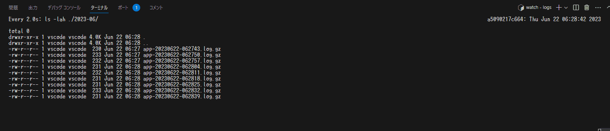

# log4j2のログのローテーションを試す

## overview

log4j2のログローテーションの動きを確認するために作ったプロジェクト。

## 結果

## 試した構成

### application

ApplicationRunnerで作られた、起動したら永遠とログを吐き続けるアプリケーションを用意した。

### ログ設定

カレントディレクトリに `logs` というディレクトリを作成しこの配下にログを吐き続ける。

<ローテーション>
吐かれたログが 1KB を超えた際に、 `yyyy-mm` でディレクトリを作成し、gzで圧縮されログローテーションされる。

<ロールオーバー>
また、ローテーションされたログは、 1分前まで保持され、1分を過ぎたら削除される。

### メモ

解説の何かを書こうと思ったら、ドキュメント充実してるんであんま書くことないなぁとなっているnow。
